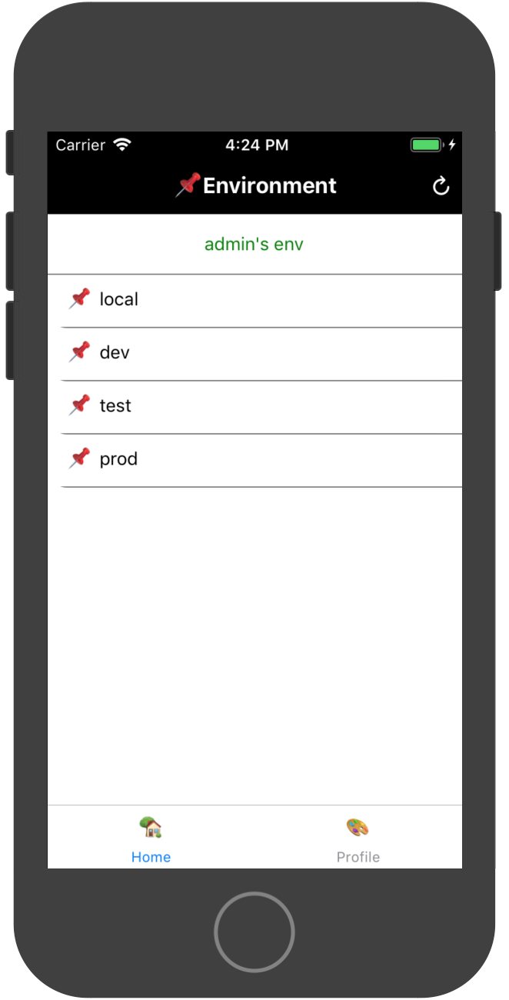
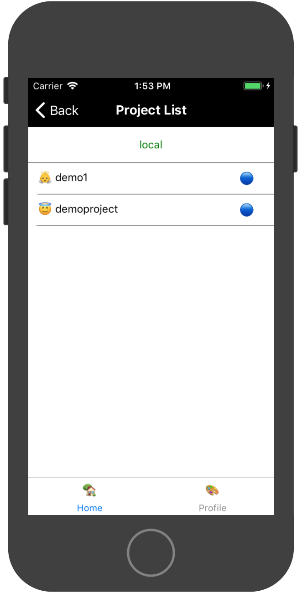
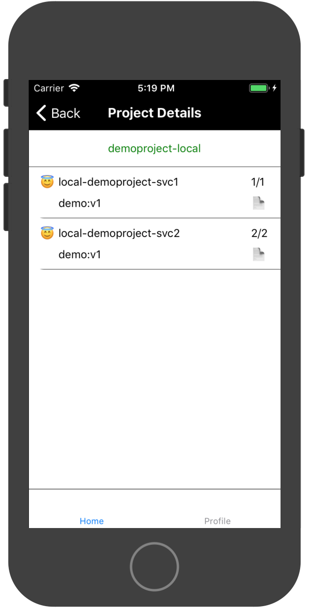
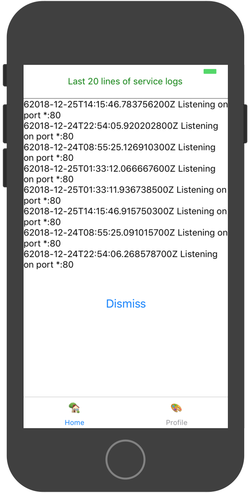
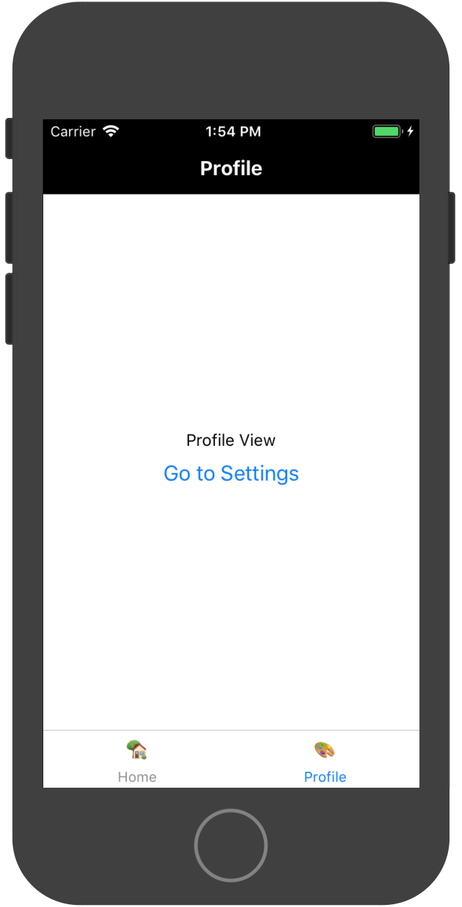
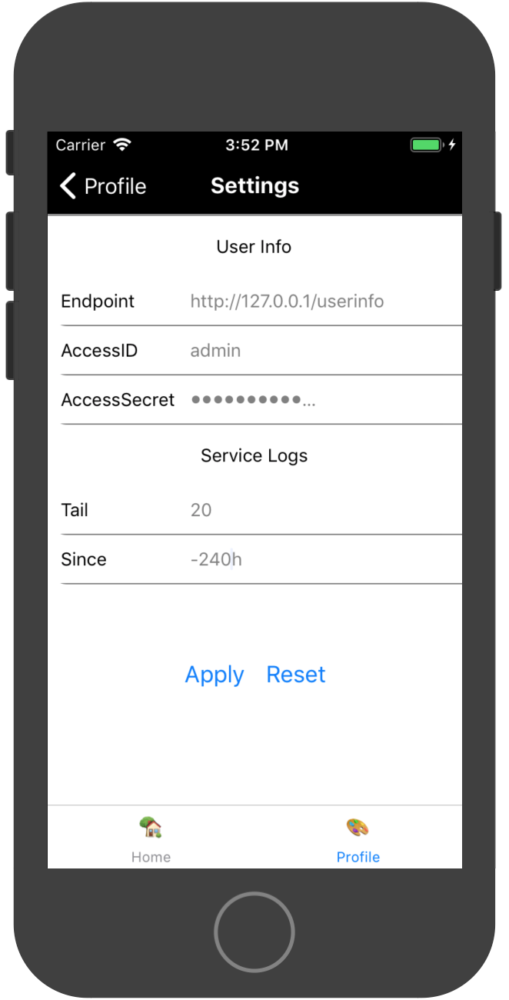

# monitor

## POC

### Backend init

* create docker-swarm-service

```bash
docker pull opera443399/whoami
docker tag opera443399/whoami ns-demo/demo:v1
docker tag opera443399/whoami hub.demo.com/ns-demo/demo:v1


docker service create --name local-demoproject-svc1 --detach=true --with-registry-auth --publish "5001:80" --replicas=1 ns-demo/demo:v1
docker service create --name local-demoproject-svc2 --detach=true --with-registry-auth --publish "5002:80" --replicas=2 hub.demo.com/ns-demo/demo:v1

```

* setup etcd

```bash
##### init project info
ETCDCTL_API=3 /usr/local/bin/etcdctl put /monitor/local/projects '{"env":"local","data":[{"icon":"👼","name":"demo1","status":"1"},{"icon":"😇","name":"demoproject","status":"1"}]}'
##### init accessToken
ETCDCTL_API=3 /usr/local/bin/etcdctl put /monitor/local/accessToken/xxx true
ETCDCTL_API=3 /usr/local/bin/etcdctl put /monitor/local/accessToken/yyy false
##### init userinfo
ETCDCTL_API=3 /usr/local/bin/etcdctl put /monitor/userinfo/admin/secrets/xxx true
ETCDCTL_API=3 /usr/local/bin/etcdctl put /monitor/userinfo/admin/env '
{
  "data":[
    {
      "env":"local",
      "urlPrefix":"http://127.0.0.1",
      "accessToken":"xxx"
    },
    {
      "env":"dev",
      "urlPrefix":"http://127.0.0.1",
      "accessToken":"xxx"
    },
    {
      "env":"test",
      "urlPrefix":"http://127.0.0.1",
      "accessToken":"xxx"
    },
    {
      "env":"prod",
      "urlPrefix":"http://127.0.0.1",
      "accessToken":"xxx"
    }
  ]
}'

```

* run monitor
  * run local

  ```bash
  # make
  # ./bin/monitor -port 80 -node "127.0.0.1:2379" -log-level debug

  2018-12-25T15:09:21+08:00 dev.local ./bin/monitor[45348]: INFO KVStore backend set to: etcdv3
  2018-12-25T15:09:21+08:00 dev.local ./bin/monitor[45348]: INFO Listening on port *:80
  2018-12-25T15:10:41+08:00 dev.local ./bin/monitor[45348]: DEBUG [kvstore] key set to: /monitor/local/accessToken/xxx
  2018-12-25T15:10:41+08:00 dev.local ./bin/monitor[45348]: DEBUG [kvstore] [127.0.0.1:2379]: get [/monitor/local/accessToken/xxx]
  2018-12-25T15:10:41+08:00 dev.local ./bin/monitor[45348]: DEBUG [kvstore] result: map[/monitor/local/accessToken/xxx:true]
  2018-12-25T15:10:41+08:00 dev.local ./bin/monitor[45348]: DEBUG [kvstore] [127.0.0.1:2379]: get [/monitor/local/projects]
  2018-12-25T15:10:41+08:00 dev.local ./bin/monitor[45348]: DEBUG [query-projects] response: {"env":"local","data":[{"icon":"👼","name":"demo1",
  "status":"1"},{"icon":"😇","name":"demoproject","status":"1"}]}
  2018-12-25T15:10:42+08:00 dev.local ./bin/monitor[45348]: DEBUG [kvstore] key set to: /monitor/local/accessToken/xxx
  2018-12-25T15:10:42+08:00 dev.local ./bin/monitor[45348]: DEBUG [kvstore] [127.0.0.1:2379]: get [/monitor/local/accessToken/xxx]
  2018-12-25T15:10:42+08:00 dev.local ./bin/monitor[45348]: DEBUG [kvstore] result: map[/monitor/local/accessToken/xxx:true]
  2018-12-25T15:10:42+08:00 dev.local ./bin/monitor[45348]: DEBUG [query-services] response:{"env":"local","projectName":"demoproject","data":[
  {"id":"kacjc7h2bp","name":"local-demoproject-svc1","replicas":"1/1","image":"demo:v1"},{"id":"saz35fg0b8","name":"local-demoproject-svc2","replicas":"2/2","ima
  ge":"demo:v1"}]}


  ```

  * run on Linux

  ```bash
  docker pull opera443399/monitor
  test $(docker ps -a -f name=monitor -q |wc -l) -eq 0 || \
  docker rm -f monitor

  docker run -d --restart always \
      --name monitor \
      -p "80:12000" \
      -v /var/run/docker.sock:/var/run/docker.sock \
      -v /etc/localtime:/etc/localtime \
      -e KV_BACKEND_NODES="127.0.0.1:2379" \
      -e LOG_LEVEL="debug" \
      opera443399/monitor

  docker logs --tail 100 --since 5m -f monitor

  ```

  * run on Mac

  ```bash
  docker pull opera443399/monitor
  test $(docker ps -a -f name=monitor -q |wc -l) -eq 0 || \
  docker rm -f monitor

  docker run -d --restart always \
      --name monitor \
      -p "80:12000" \
      -v /var/run/docker.sock:/var/run/docker.sock \
      -e KV_BACKEND_NODES="127.0.0.1:2379" \
      -e LOG_LEVEL="debug" \
      opera443399/monitor

  docker logs --tail 100 --since 5m -f monitor

  ```

### App init

* init rn

```bash
# react-native init yourProjectName
# cd yourProjectName
# yarn add react-navigation
# yarn add react-native-gesture-handler
# react-native link react-native-gesture-handler

```

* run

copy `App.js` and `css.js` to your project, then run the demo on your simulator or device

## Snapshots







